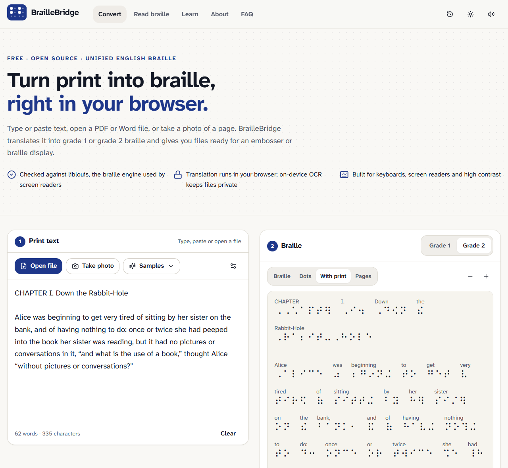
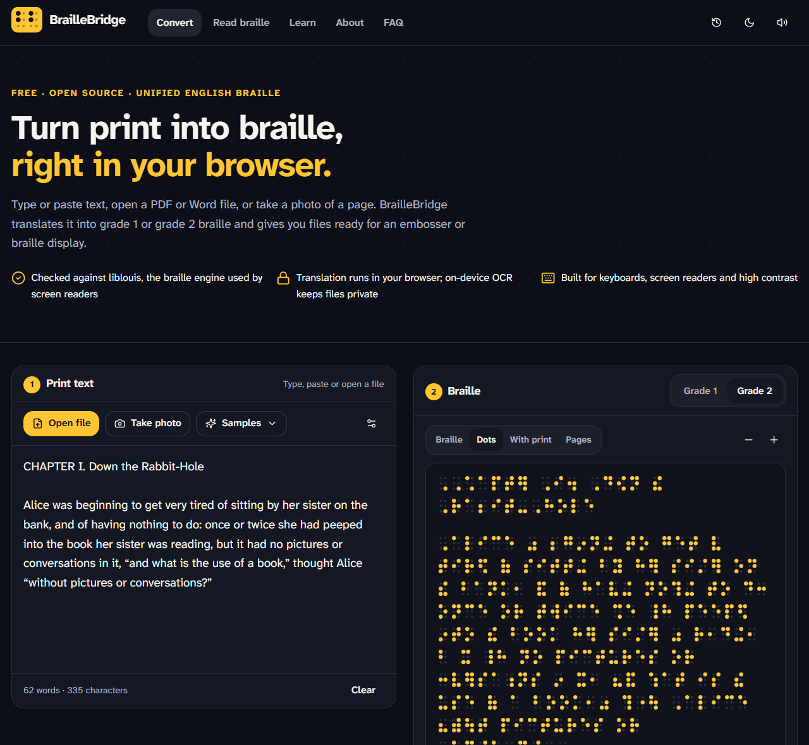
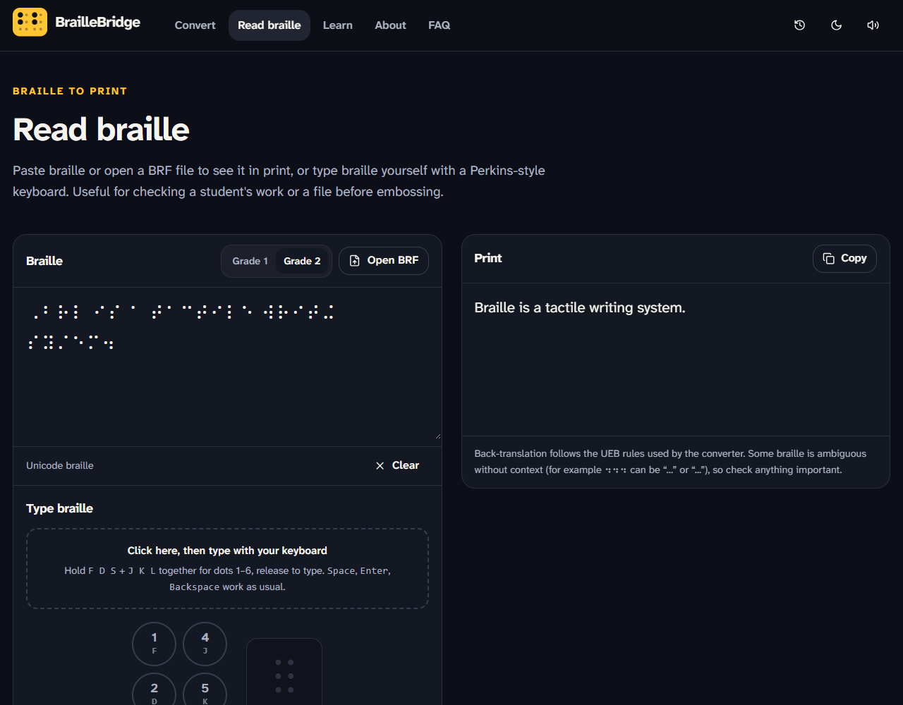
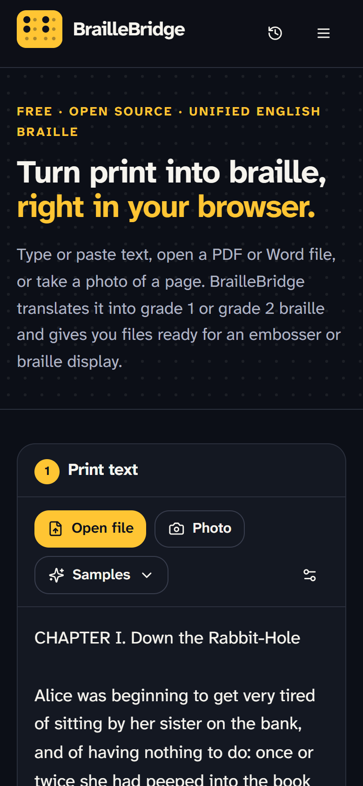
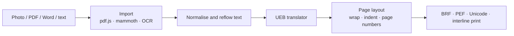

# BrailleBridge

**Turn print into braille, right in your browser.** BrailleBridge translates typed text, PDFs, Word documents and photos of printed pages into Unified English Braille (grade 1 and grade 2) and exports files ready for braille embossers and refreshable braille displays.

[](https://github.com/kattabeknorbaev/BrailleBridge/actions/workflows/ci.yml) [](LICENSE)

**Live app:** https://bridgebraille.lovable.app



---

## Why

Most printed material never becomes braille. Worksheets, letters, menus and notices usually need expensive transcription software or a trained transcriber, and much of that software is hard to use with a screen reader. BrailleBridge is a free tool that a teacher, a parent or a braille reader can open in any browser and use straight away.

## Features

- **Accurate UEB translation.** A rule-based Unified English Braille translator for grade 1 (uncontracted) and grade 2 (contracted) braille, tested against [liblouis](https://liblouis.io) on 7,000 words (see [Accuracy](#accuracy)).
- **Any input.** Type or paste text, or open PDFs, Word (.docx), text and BRF files. Photos and scanned pages are read with OCR: a cloud vision model, or [Tesseract](https://tesseract.projectnaptha.com/) running entirely on the device for privacy. Line breaks from the printed page layout are joined back into paragraphs.
- **Embosser-ready output.** Word-wrapped braille pages (cells per line and lines per page are configurable) with paragraph indents and braille page numbers, exported as:
  - **BRF** (North American Braille ASCII), which almost any embosser, notetaker or braille display can read
  - **PEF** (Portable Embosser Format), an open XML standard
  - Unicode braille text
  - A printable interline copy with the print word above each braille word, for sighted teachers
- **Four previews.** Unicode braille, drawn dots, interline print, and exact embosser pages.
- **Braille to print.** Back-translates braille or BRF files, and has a Perkins-style six-key keyboard (hold `F D S` + `J K L`, release to type a cell).
- **Learn.** A searchable reference of every UEB sign the translator uses, generated from the same tables, plus a practice quiz.
- **Accessible by design.** Keyboard operable, screen-reader announcements, light, dark and high-contrast themes that follow system settings, the Atkinson Hyperlegible typeface, and reduced-motion support. Every page passes an [axe](https://github.com/dequelabs/axe-core) WCAG 2.2 AA audit in all three themes.
- **Private and fast.** Translation, import and export run in the browser. A 25,000-word book chapter (134 braille pages) translates in about 0.1 seconds, and while you edit, only the changed paragraph is translated again.

| Dots preview (dark theme) | Read braille and Perkins keyboard | Mobile |
| --- | --- | --- |
|  |  |  |

## How the translator works



The translator ([`src/lib/braille/ueb.ts`](src/lib/braille/ueb.ts)) follows the structure of the *Rules of Unified English Braille*. It works on "symbols-sequences", runs of characters between spaces, and applies these rules in order:

1. **Numbers** get the numeric indicator `⠼`. Decimal points, commas and simple fractions stay in numeric mode. Letters a–j straight after a digit get a grade 1 indicator (`10am` → `⠼⠁⠚⠰⠁⠍`) so they are not read as digits.
2. **Capitals** are marked per letter (`⠠`), per word (`⠠⠠`, with a terminator `⠠⠄` if lowercase follows, as in `CDs`) or per passage of three or more capitalised words (`⠠⠠⠠ … ⠠⠄`).
3. **Whole-word signs.** Wordsigns (`you` → `⠽`), the 75 shortforms (`quick` → `⠟⠅`) and lower wordsigns (`was` → `⠴`) are used only when the word "stands alone". Lower wordsigns have the stricter punctuation rules.
4. **Contractions inside words** are chosen by dynamic programming. Every groupsign has position rules (for example, `ea` only between letters, `ing` never first, and `be`/`con`/`dis` only as a first syllable), and the translator picks the valid combination with the fewest cells. Ties are broken the way transcribers do: `shade` is sh-a-d-e, not s-had-e, and `prisoner` is o-n-er, not one-r.
5. **Safety checks.** A word that would read as a *different* wordsign is spelled out (`sch` → `⠎⠉⠓`, because `⠎⠡` means "such"), and gets a grade 1 indicator if even the spelling is ambiguous (`b` → `⠰⠃`).

Words where English morphology matters, such as compounds and prefixes (`no|where`, `re|action`), are handled by a short, documented [exception list](src/lib/braille/ueb-tables.ts).

## Accuracy

The engine is tested against **liblouis**, the braille translation library used by the NVDA and JAWS screen readers and by BRLTTY. The test corpus contains 7,000 words and 350 sentences from ten public-domain books. Five of the books were used while developing the rules; the other five are a **held-out** set the rules were never tuned on.

| | Grade 1 | Grade 2 |
| --- | --- | --- |
| Words identical to liblouis | 7,000 / 7,000 (100%) | 6,996 / 7,000 (99.94%) |
| Sentences identical to liblouis¹ | 273 / 273 | 273 / 273 |
| Round trip, print → braille → print | 7,000 / 7,000 | 7,000 / 7,000 |

¹ The reference build is liblouis 3.1 (2017), which predates two table fixes: the em dash is `⠠⠤`, and `’` is an apostrophe or closing quote, never `⠴⠄`. Sentences containing `’` are excluded, and the dash fix is applied to the expected output. The four grade 2 words that differ are dialect spellings and a name (`bez`, `becuz`, `leah`, `citizeness`). All of this is documented in [`liblouis-corpus.test.ts`](src/lib/braille/__tests__/liblouis-corpus.test.ts).

The corpus can be regenerated byte-for-byte with [`scripts/build-liblouis-fixture.mjs`](scripts/build-liblouis-fixture.mjs).

## Getting started

Requires Node.js 20 or later.

```bash
git clone https://github.com/kattabeknorbaev/BrailleBridge.git
cd BrailleBridge
npm install
npm run dev          # http://localhost:8080
```

| Command | What it does |
| --- | --- |
| `npm run dev` | Start the development server |
| `npm test` | Run the test suite (59 tests, including the liblouis corpus) |
| `npm run typecheck` / `npm run lint` | Static checks |
| `npm run build` | Production build in `dist/` |
| `npm run check` | All of the above, as CI runs them |

### Configuration

Everything except cloud OCR and the feedback form works without a backend. To enable them, copy `.env.example` to `.env` and add a Supabase project URL and public (anon) key. The cloud OCR endpoint is a Supabase Edge Function in [`supabase/functions/ocr`](supabase/functions/ocr/index.ts).

## Project structure

```
src/
  lib/braille/        Translation engine (no UI dependencies)
    ueb-tables.ts     UEB signs and contraction rules, written as dot numbers
    ueb.ts            Print → braille translator
    back.ts           Braille / BRF → print
    layout.ts         Word wrap, pagination, page numbers
    export.ts         BRF and PEF writers
    cells.ts          Dot patterns, Unicode braille, Braille ASCII
  lib/import/         PDF, Word, BRF and image import; cloud and on-device OCR
  components/         UI (React, Tailwind, Radix primitives)
  pages/              Convert, Read braille, Learn, About, FAQ, …
supabase/             OCR edge function and database migrations
scripts/              Test fixture generator
```

## Limitations

- English literary braille (UEB) only. No mathematics (UEB technical or Nemeth), music braille or other languages yet.
- Tables and multi-column layouts become plain text, and bold, italics and headings are not marked yet.
- OCR can misread photos. Review the recognised text before embossing, and use a certified transcriber for exams and legal documents.

## Roadmap

- Emphasis indicators and headings from Word and PDF structure
- Braille for Russian and Uzbek
- UEB technical material (maths)
- Offline install as a Progressive Web App

## Acknowledgements

- [liblouis](https://liblouis.io), the reference used to test the translator
- *Rules of Unified English Braille* (ICEB, 2013) and BANA guidance
- [Atkinson Hyperlegible](https://www.brailleinstitute.org/freefont/) by the Braille Institute
- [Tesseract.js](https://tesseract.projectnaptha.com/), [pdf.js](https://mozilla.github.io/pdf.js/) and [mammoth](https://github.com/mwilliamson/mammoth.js)
- Sample texts from Project Gutenberg

## Changelog

### v2.0
- New rule-based UEB translation engine, tested against liblouis, with back-translation
- Correct BRF output (the earlier version used a wrong character table and no page breaks); added PEF export and removed the invalid "DXP" export
- Word, text and BRF import; PDF text extraction; on-device OCR with automatic fallback
- New converter workspace with live translation, four preview modes, page layout settings and interline printing
- New Read braille (with Perkins keyboard) and Learn pages
- Redesigned interface with light, dark and high-contrast themes; audited with axe for WCAG 2.2 AA
- 59 automated tests and continuous integration

### v1.1
- Conversion summary, side-by-side preview, grade explanations, known limitations section

### v1.0
- OCR text extraction, grade 1 and grade 2 conversion, accessibility-first design

## License

[MIT](LICENSE) © 2026 Kattabek Norbaev

---

Built by **Kattabek Norbaev**.
